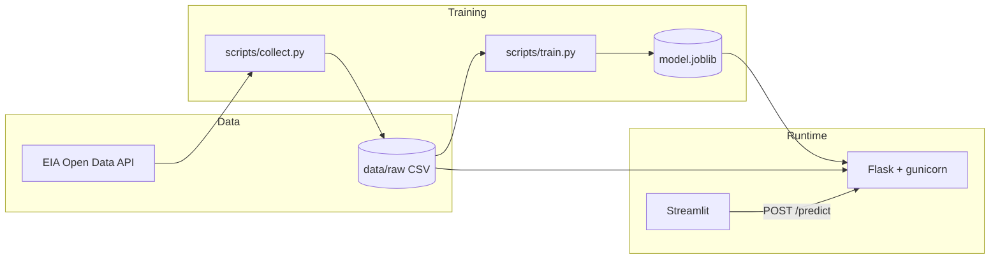

# U.S. retail gasoline price forecast — full stack demo

End-to-end pipeline for **STAT 418**: pull weekly U.S. gasoline prices (or synthetic fallback), train **two** forecasters (**XGBoost** and **SARIMA**), expose predictions through a **Flask** API, and choose the method in **Streamlit**. Both services are **Dockerized** for deployment to **Google Cloud Run** (or any container host).

## Data source

- **Primary:** [EIA Open Data API](https://www.eia.gov/opendata/) — petroleum retail gasoline (`/v2/petroleum/pri/gnd/`). Register for a key at [EIA registration](https://www.eia.gov/opendata/register.php) and browse series at [petroleum / pri](https://www.eia.gov/opendata/browser/petroleum/pri).
- Default series ID: `EMM_EPM0_PTE_NUS_DPG` (override with `EIA_SERIES_ID` in `.env` if you pick another weekly series).
- If `EIA_API_KEY` is **not** set, `scripts/collect.py` writes a **synthetic** weekly series so you can still train and run the app locally or in CI.

**Never commit your API key.** Copy `.env.example` to `.env` and fill in `EIA_API_KEY` locally only.

## Repository layout

| Path | Purpose |
|------|---------|
| `scripts/collect.py` | Download EIA JSON → `data/raw/gasoline_weekly.csv` |
| `scripts/train.py` | Feature engineering → `data/processed/gasoline_modeling.csv` + `models/xgboost.joblib` + `models/sarima.joblib` |
| `notebooks/eda_preprocessing.ipynb` | EDA, data quality checks, preprocessing explanation, and model evaluation summary |
| `app_lib/models.py` | Train / forecast XGBoost (recursive lags) and SARIMA (direct multi-step) |
| `app_lib/features.py` | Lag features, training helper, recursive forecast |
| `api/app.py` | Flask API (`/health`, `/metadata`, `/predict`) |
| `streamlit_app/app.py` | UI calling the API |
| `deploy/Dockerfile.api` / `Dockerfile.streamlit` | Container images |
| `deploy/docker-compose.yml` | Local two-container stack |
| `requirements-api.txt` | Leaner dependency set for the API container |

## Quick start (local, no Docker)

```bash
cd fuel-price-forecast-app
python3 -m venv .venv
source .venv/bin/activate   # Windows: .venv\Scripts\activate
pip install -r requirements.txt
cp .env.example .env        # add EIA_API_KEY if you have one
python scripts/collect.py
python scripts/train.py
```

**Terminal 1 — API**

```bash
export PYTHONPATH="$(pwd)"
gunicorn -b 127.0.0.1:8080 api.app:app
```

**Terminal 2 — Streamlit**

```bash
export PYTHONPATH="$(pwd)"
export MODEL_API_URL=http://127.0.0.1:8080
streamlit run streamlit_app/app.py
```

Open the Streamlit URL (usually http://localhost:8501), set horizon, click **Get forecast**.

## Docker Compose (API + Streamlit)

From this directory:

```bash
docker compose -f deploy/docker-compose.yml up --build
```

- API: http://localhost:8080/health  
- Streamlit: http://localhost:8501 (preconfigured to call `http://api:8080` inside the compose network)

Rebuild images after you re-run `collect.py` / `train.py` so `data/` and `models/` layers update.

## API contract

**Refresh data & models (clickable from Streamlit sidebar, or call the API):**

| Endpoint | Method | Description |
|----------|--------|-------------|
| `/data/sources` | GET | JSON with EIA portal / register / docs URLs |
| `/data/history` | GET | Historical gasoline series currently used by the API |
| `/data/collect` | POST | Download latest weekly gasoline from EIA → `data/raw/gasoline_weekly.csv` |
| `/models/train` | POST | Retrain deployed XGBoost on current CSV; keep packaged SARIMA comparison |
| `/pipeline/run` | POST | **Collect + retrain deployed XGBoost** in one step |

`POST /predict`

```json
{ "horizon": 8, "method": "xgboost" }
```

`method` must be `"xgboost"` or `"sarima"`.

Response:

```json
{
  "method": "xgboost",
  "method_label": "XGBoost (recursive lags)",
  "horizon_weeks": 8,
  "last_historical_period": "2025-...",
  "validation_mae": 0.06,
  "validation_rmse": 0.10,
  "forecasts": [
    { "period": "2025-...", "forecast_price": 3.45 }
  ]
}
```

**macOS:** if `import xgboost` fails with `libomp.dylib`, run `brew install libomp` and restart the terminal.

## Solution architecture



## Cloud deployment notes

- **API image:** push to Artifact Registry, deploy to **Cloud Run** (port 8080, set `MODEL_PATH` / `RAW_GAS_CSV` if you change paths).
- **API memory:** use at least `1Gi` on Cloud Run so SARIMA forecasts have enough memory.
- **Streamlit image:** deploy second Cloud Run service; set env `MODEL_API_URL` to the **public URL** of the API service.
- Ensure the **same** `data/raw` snapshot and `models/` artifacts you trained on are baked into the API image (or mount from object storage for production).

After deployment, add the two public URLs here before submission:

- Streamlit app: https://fuel-price-streamlit-oluqiqxkmq-uw.a.run.app
- Flask API: https://fuel-price-api-oluqiqxkmq-uw.a.run.app

Example API checks:

```bash
curl https://YOUR_API_URL/health
curl -X POST https://YOUR_API_URL/predict \
  -H "Content-Type: application/json" \
  -d '{"horizon":8,"method":"xgboost"}'
```

## Tests & CI

```bash
pytest -q
```

GitHub Actions (`.github/workflows/ci.yml`) runs `collect` (synthetic) + `train` + `pytest` on each push.

## AI assistant usage (course requirement)

Document in your own words how you used tools such as Cursor or Copilot: prompts that helped, where you changed generated code, and lessons learned. A starter checklist is in this README; expand it in your standalone project repo.

- **Helpful:** scaffolding Flask/Streamlit layout, Docker multi-service compose, EIA v2 query parameters.
- **Edited manually:** default EIA series ID, validation window size, Streamlit layout, deployment env vars.
- **Risk:** never paste API keys into chat or commit them—rotate keys if exposed.

## Final writeup notes

Current dataset snapshot: weekly U.S. retail gasoline observations through **2026-05-18**.

Model comparison on a 52-week holdout:

| Model | MAE ($/gal) | RMSE ($/gal) | Notes |
|-------|-------------|--------------|-------|
| XGBoost | 0.0579 | 0.1004 | Lag and calendar features, recursive multi-step forecast |
| SARIMA | 0.2386 | 0.4217 | Weekly univariate seasonal time-series model |

For the final writeup, expand this section with EDA charts, data cleaning notes, feature choices, deployment screenshots/links, and a short discussion of limitations. Important limitations: the model uses national weekly prices rather than local pump-level observations, and short-term fuel prices can change faster than the forecast model updates.

## Moving to your standalone GitHub repo

This folder is self-contained: copy `fuel-price-forecast-app/` into a new repository for submission, add your name, expand the README with your architecture screenshot, deployment URLs, and AI-assistant narrative.
