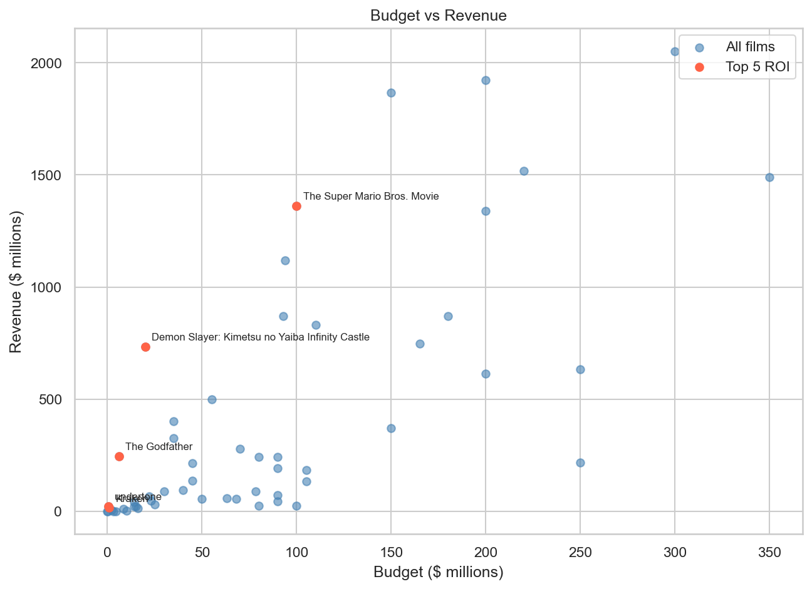
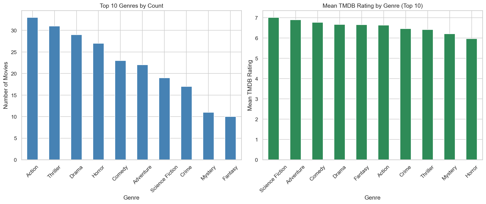
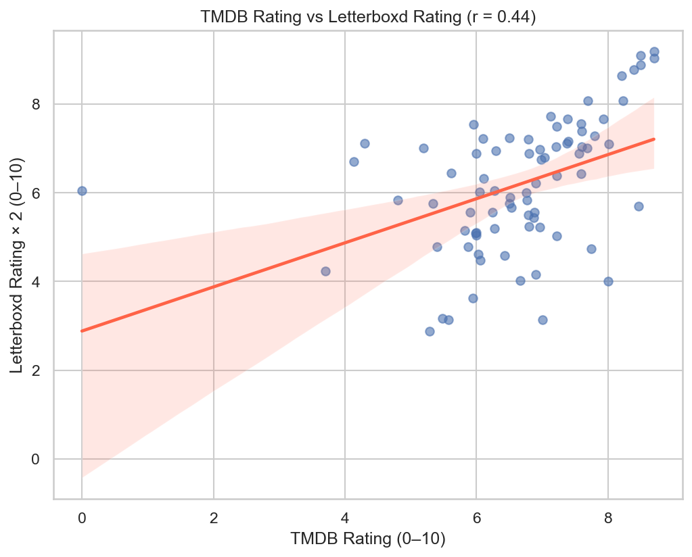
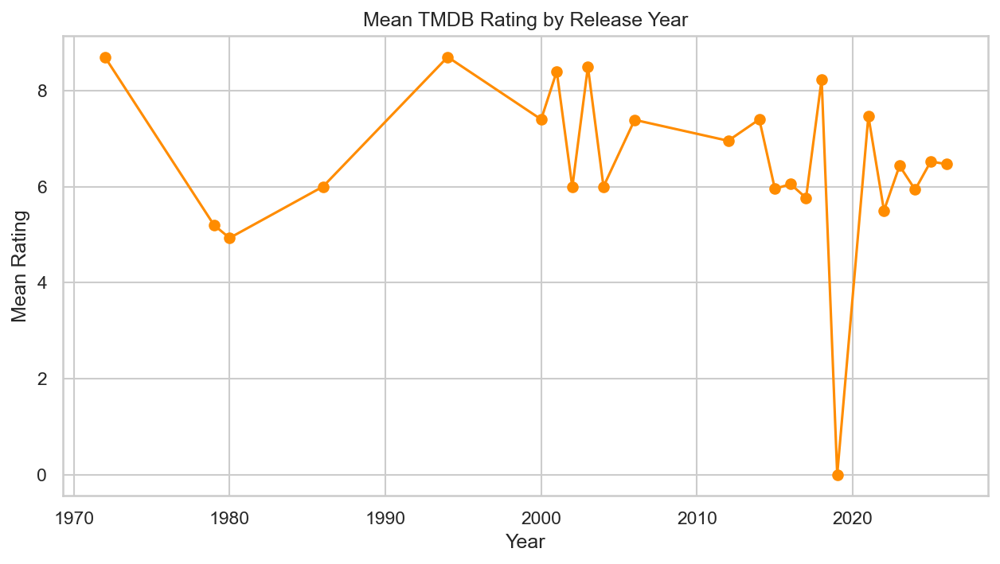

# Movie API and Web Scraping Analysis Report

# Data Collection Summary

### The pipeline collects the top 100 movies from the TMDB api popular page, equating to the top 100 most popular movies at this time. 

The request collects data such as the movie title and description, genres, cast and actor information, release date, revenue, and more.

### The titles of the collected top 100 movies are used to scrape additional information from Letterboxd.

The main data point collected from Letterboxd is the fan rating and number of fans for each movie.

# Visualization Analysis

This visualization shows all movies plotted based on budget compared to revenue, and highlights the top 5 movies based on ROI. The plot shows a mix of movies with high budgets with a decent spread on revenue, along with many movies with lower budgets that had lower revenue ratios. 

This dual plot shows the top 10 genres by number of movies along with the mean TMDB rating for those top 10 genres. The mean TMDB rating shows a very consistent trend where on average, movies are rated between high 5's to around 7 regardless of genre. In comparison, the top 10 genres by count visualization shows that there are significantly more movies in genres like "Action" and "Thriller" compared to "Mystery" or "Fantasy" despite the overall rating trend.

This visualization compares movie ratings from TMDB and normalized ratings from Letterboxd. There is a general trend for the ratings, with one outlier with a 0 rating on TMDB but a 6 on Letterboxd. The trend line shows a positive correlation, indicating a moderate positive relationship between the two platforms (r ≈ 0.44). In other words, movies that score higher on TMDB tend to also receive higher ratings on Letterboxd, but the relationship is not especially strong.

This visualization plots average TMDB rating over time. The plot mirrors the previous trend of average ratings being in the 5 to 7 range, although the plot is affected by missing data. There are less data points and bigger jumps in the years before 2000, and there are no movies released in 2020. In comparison, years after 2010 all have data points and show a general congregation except for 2020.

# Interesting Insights

Utilizing ROI as a metric for success highlights how niche movies can also perform well contextually compared to major blockbusters. For example, "Kraken" and "undertone" are both films with nearly the smallest budgets in the entire list of movies, and they earned enough revenue to highlight the ROI ratio. In comparison, "The Super Mario Bros. Movie" is also in the top 5 ROI movies with a budget of $100 million.

A general trend in average TMDB ratings being between 5 and 7 was shown across both genres and years. This makes sense as viewers are more likely to rate movies positively and the 5 to 7 range balances out both extreme positive and negative reviews.

The relationship in TMDB score and Letterboxd score shows a general positive correlation, indicating that users of both platforms are rating movies similarly. However, looking at the plot there are fairly big differences in how movies are rated on both platforms. This could be because of the nature of the two, with more casual viewers rating on TMDB and cinephiles rating on Letterboxd.

# Challenges and Solutions

One challenge I ran into when translating the titles from TMDB to Letterboxd links was that for some movies such as "The Shadow's Edge" and "Now You See Me: Now You Don't" where they weren't the first movie with that name. For both of these movies, the Letterboxd link adds a 2025 to the end of the title. I only caught this because I didn't remove apostrophes when converting the title to a slug.

Not sure if other movies also have this issue as I only saw the problem with these two movies when trying to fix the link, and I manually added 2025 to the end of the titles in the TMDB data.

# Limitations and Future Improvements

The pipeline only collected 100 movies, leading to some limitations in data. For example, the temporal analysis was very jagged and the trend was hard to see because of how little data there was. In the future, collecting more data through specifying more pages in api_collector.py can fix this.

Some movies on Letterboxd are too recent and rating and number of fans hasn't been released yet so both of the data points are null. Some future improvements could be to collect more movies to offset the unusable data points from these movies.