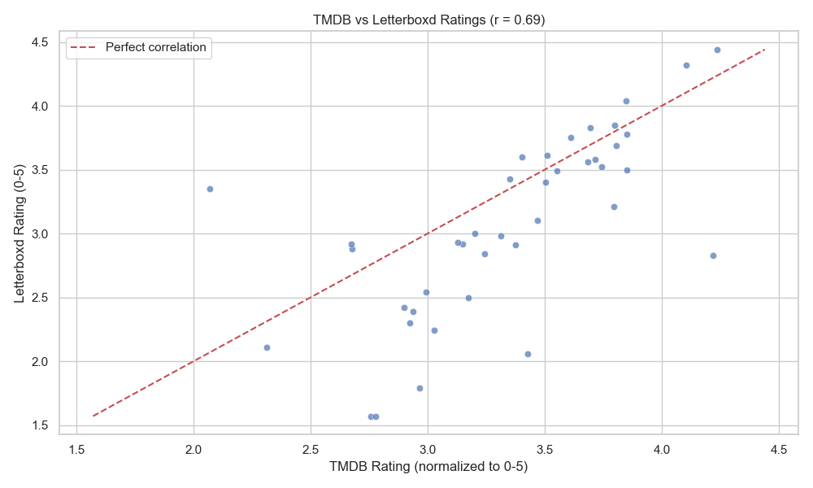
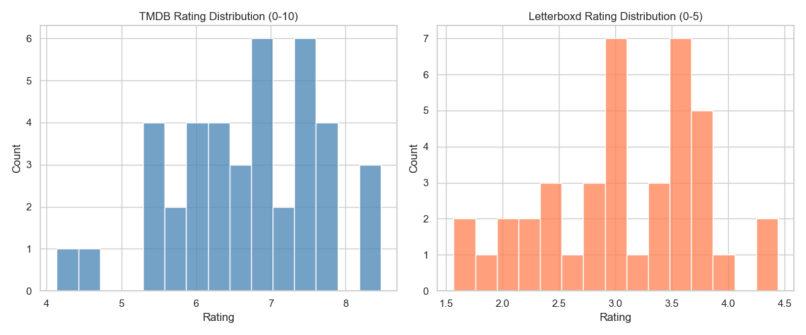
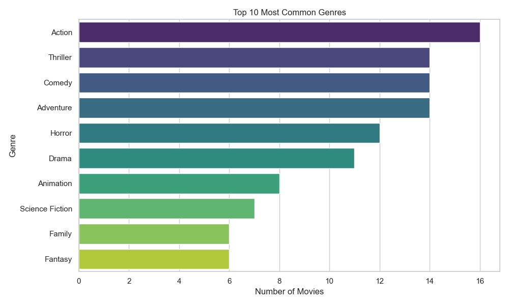
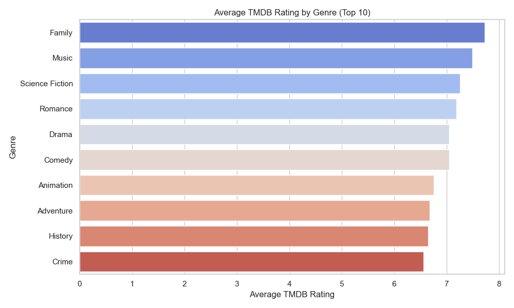
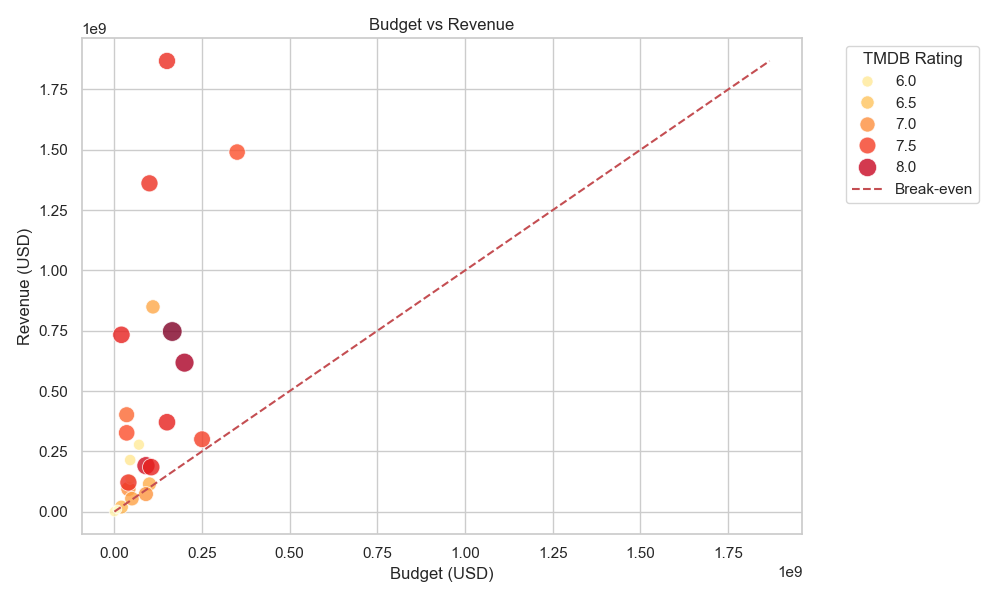
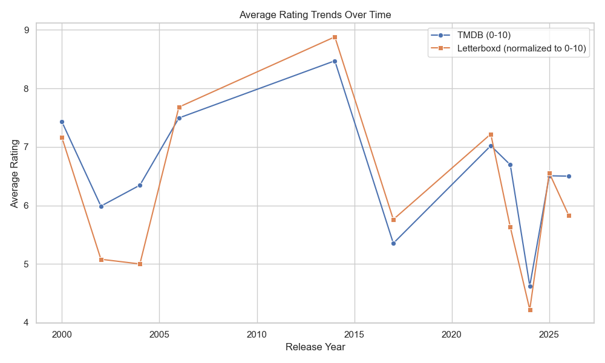
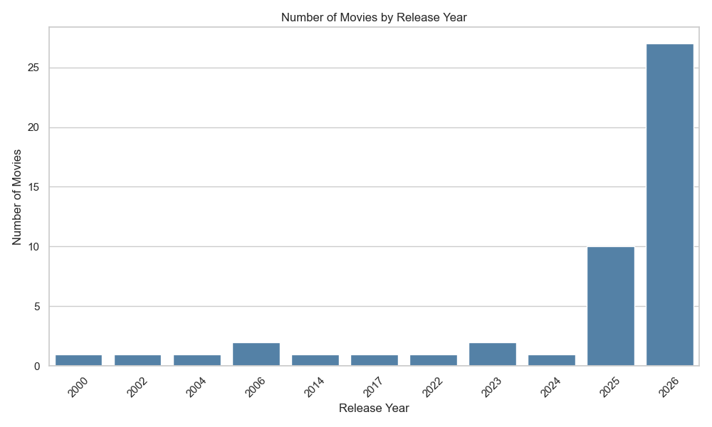

# Assignment 2: Report

## Data Collection Summary

| Source     | Records Collected | Method       |
|------------|-------------------|--------------|
| TMDB API   | 50 movies         | REST API     |
| Letterboxd | 50 movies scraped | Web scraping |
| **Final dataset** | **48 movies** | Merged on title + year |

Data was collected on May 2, 2026. The dataset spans release years from 2000 to 2026,
though it is heavily weighted toward recent releases (2025-2026) due to TMDB's
"popular movies" endpoint favoring recency.

Two movies were dropped during the merge step due to title mismatches between
TMDB and Letterboxd.

---

## Analysis Findings

### 1. Rating Correlation (TMDB vs Letterboxd)

The correlation between TMDB and Letterboxd ratings (normalized to the same 0-5 scale)
was **r = 0.69**, indicating a moderate to strong positive relationship. In general,
movies that score well on TMDB also tend to score well on Letterboxd.

However, there are notable differences in how the two platforms distribute ratings:
- **TMDB** ratings cluster between 6.0 and 8.0 out of 10, with a roughly normal distribution.
- **Letterboxd** ratings cluster between 2.5 and 4.0 out of 5, and tend to skew slightly
  lower than TMDB when normalized to the same scale.

This suggests Letterboxd's user base is more critical on average than TMDB's, which makes
sense given that Letterboxd attracts more dedicated cinephiles compared to TMDB's broader audience.

There are a few clear outliers — some movies rated highly by TMDB received notably lower
scores on Letterboxd, suggesting mainstream appeal does not always translate to critical
appreciation from film enthusiasts.

**Average ratings:**
- TMDB: 6.55 / 10
- Letterboxd: 3.07 / 5 (equivalent to 6.14 / 10)

---

### 2. Genre Analysis

**Most common genres** in the dataset of popular movies:
- Action (16 movies) dominated by a wide margin
- Thriller, Comedy, and Adventure were tied at 14 movies each
- Horror followed closely at 12 movies

This reflects the kinds of films that tend to dominate box office popularity — high-energy,
broadly appealing genres that attract large audiences.

**Highest rated genres by average TMDB score:**
- Family (7.7) and Music (7.5) topped the ratings despite being less common in the dataset
- Science Fiction (7.3) and Romance (7.2) also scored highly
- Crime (6.6) and History (6.6) ranked lowest among the top 10

This is an interesting contrast — Action dominates in volume but does not lead in ratings.
Family and Music films, while less frequent among popular movies, tend to be more
universally well-received when they do appear.

---

### 3. Financial Analysis (Budget vs Revenue)

Financial data was available for **24 of the 48 movies** — TMDB records budget and revenue
as 0 for unknown values, which were treated as missing.

Key findings:
- Most movies in the dataset had budgets under $400M, with revenues concentrated
  below $500M as well.
- The majority of movies with financial data sit **above the break-even line**,
  meaning popular movies tend to be profitable — which is expected given we're
  sampling from TMDB's most popular films.
- **Zootopia 2** was the most profitable movie in the dataset with a profit of
  approximately **$1.72 billion**, driven by massive revenue relative to its budget.
- A few outliers with small budgets generated surprisingly high revenue, suggesting
  strong word-of-mouth or franchise appeal.
- Higher TMDB ratings (darker red dots) are loosely associated with higher revenues,
  though there are exceptions in both directions.

---

### 4. Temporal Analysis

**Movies by release year:**
The dataset is heavily skewed toward 2025 (10 movies) and 2026 (27 movies), with
only a handful of movies from earlier years. This is a direct consequence of using
TMDB's "popular movies" endpoint, which weights recency heavily.

**Rating trends over time:**
- The 2013-2014 period stands out as a high quality era, with both TMDB and Letterboxd
  agreeing on above-average ratings (TMDB ~8.5, Letterboxd normalized ~8.9).
- The year 2024 shows a notable dip in average ratings on both platforms, dropping
  to around 4.6-4.2 respectively — suggesting the few 2024 films in this dataset
  were not particularly well received.
- Both platforms track each other closely over time, reinforcing the r = 0.69
  correlation finding — when one platform rates a year highly, the other tends to as well.
- 2026 films average around 6.5 on both scales, which is close to the overall dataset
  average, though it is worth noting most 2026 films are very recently released and
  may have fewer ratings.

---

## Interesting Insights

- **Letterboxd is consistently more critical than TMDB.** Across almost every year,
  Letterboxd's normalized ratings sit slightly below TMDB's, suggesting its user base
  holds films to a higher standard.
- **Action is the most common genre but not the best rated.** Family and Music films
  score higher on average, suggesting quality over quantity in those genres.
- **Recent popularity doesn't equal high ratings.** The 2024 dip shows that being
  "currently popular" on TMDB doesn't guarantee strong critical reception.
- **Most popular movies are profitable.** The majority of films with financial data
  sat above the break-even line, which makes intuitive sense — truly popular films
  tend to perform well commercially.

---

## Challenges Encountered & Solutions

| Challenge | Solution |
|---|---|
| TMDB and Letterboxd share no common ID | Built a merge key from normalized title + year |
| Some movie titles don't convert cleanly to Letterboxd URL slugs | Used regex slugification and handled 404s gracefully, dropping failed movies |
| TMDB records unknown budget/revenue as 0 | Replaced 0 values with NaN before analysis |
| OneDrive storage issues during development | Moved project to local drive outside OneDrive |
| Large `.bak` files accidentally committed | Used `git rm --cached` to remove from tracking and added `*.bak` to `.gitignore` |
| `groupna` typo in analyze_data.py | Fixed to `dropna` |

---

## Limitations & Future Improvements

- **Larger dataset:** Collecting 200-500 movies would give more statistically reliable
  results, especially for genre and temporal analyses.
- **Better title matching:** A fuzzy string matching library like `rapidfuzz` could
  reduce the number of movies dropped during the merge step.
- **TV shows:** Extending the pipeline to include TV shows would allow for a broader
  comparison across different media types.
- **Time series data:** Collecting how ratings change over time for a single film
  (not just release year) would reveal interesting patterns about how audience
  perception evolves.
- **More Letterboxd data:** Fan counts and ratings are just the surface — member
  reviews and watch counts could add richer context to the analysis.
