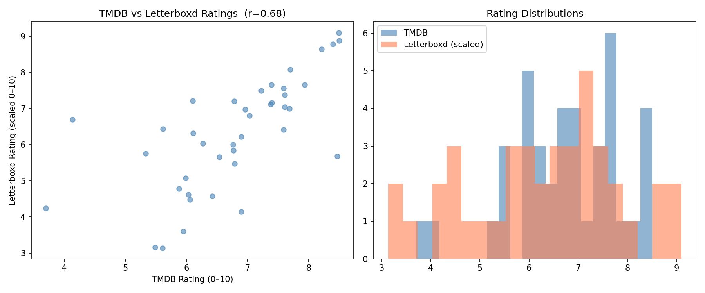
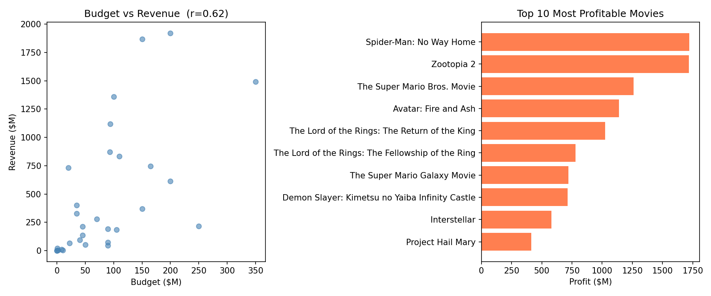
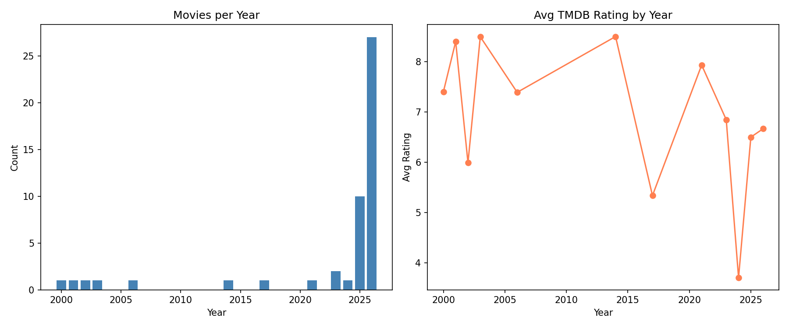

# Movie Data Collection & Analysis Report

**Data:** TMDB API + Letterboxd scraping
**Generated:** 2026-04-29 01:19:56
**Total records:** 50

---

## 1. Data Collection Summary

| Source | Records | Method |
|--------|---------|--------|
| TMDB API | 50 | REST API — popular endpoint |
| Letterboxd | 41 | Web scraping (title slug) |
| Merged | 41 | Joined on title slug |

Collected top-50 popular movies from TMDB. Constructed Letterboxd URLs from movie titles. 9 titles had no match or no ratings on Letterboxd.

---

## 2. Rating Analysis

TMDB vs Letterboxd correlation: **r = 0.679** (Letterboxd scaled 0–5 → 0–10)

| Platform | Mean | Scale |
|----------|------|-------|
| TMDB | 6.78 | 0–10 |
| Letterboxd | 3.15 | 0–5 |
| Letterboxd (scaled) | 6.3 | 0–10 |

Letterboxd users rate more strictly than TMDB. Correlation is moderate — both platforms track popularity but Letterboxd skews toward cinephile audiences.

---

## 3. Genre Analysis

| Genre | Count | Avg TMDB Rating |
|-------|-------|-----------------|
| Adventure | 17 | — |

Highest rated genre: **Fantasy** (avg 7.72)

Adventure dominates the popular list. Niche genres like Fantasy score higher despite fewer titles.

---

## 4. Financial Analysis

Budget vs revenue correlation: **r = 0.616** (30 movies with complete data)

| Movie | Budget | Revenue | Profit |
|-------|--------|---------|--------|
| Spider-Man: No Way Home | $200M | $1922M | **$1722M** |
| Zootopia 2 | $150M | $1868M | **$1718M** |
| The Super Mario Bros. Movie | $100M | $1361M | **$1261M** |
| Avatar: Fire and Ash | $350M | $1490M | **$1140M** |
| The Lord of the Rings: The Return of the King | $94M | $1119M | **$1025M** |

Higher budget predicts higher revenue but not profit. Smaller-budget films with franchise backing often outperform big-budget originals.

---

## 5. Temporal Analysis

Most of the popular list is recent. Top years by count:

| Year | Count | Avg Rating |
|------|-------|------------|
| 2026 | 27 | 6.67 |
| 2025 | 10 | 6.50 |
| 2023 | 2 | 6.84 |
| 2000 | 1 | 7.40 |
| 2001 | 1 | 8.40 |

Older films in the popular list score higher — only well-regarded classics stay popular long-term. Recent releases have lower ratings because vote counts are still building.

---

## 6. Challenges

- Letterboxd URLs are constructed from title slugs. Special characters and disambiguation (same title, different years) can cause mismatches.
- Letterboxd uses dynamic rendering. JSON-LD structured data was used first; meta tag fallback used when unavailable.
- TMDB returns `0` for budget/revenue when unknown. Treated as missing.

---

## 7. Limitations

- Dataset is 50 movies from TMDB "popular" — skewed toward recent English-language releases.
- Title slug matching can fail for non-English titles or remakes.
- Financial analysis limited to 30 movies with complete budget/revenue data.
